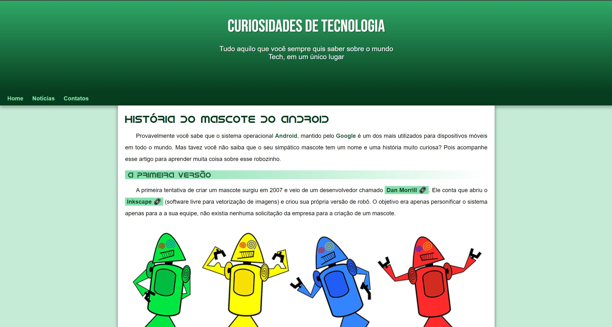
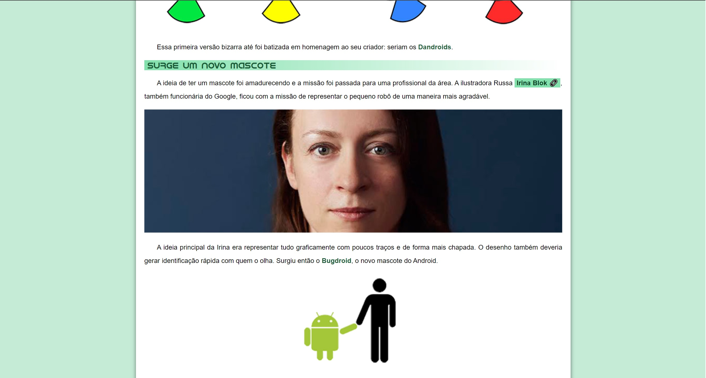
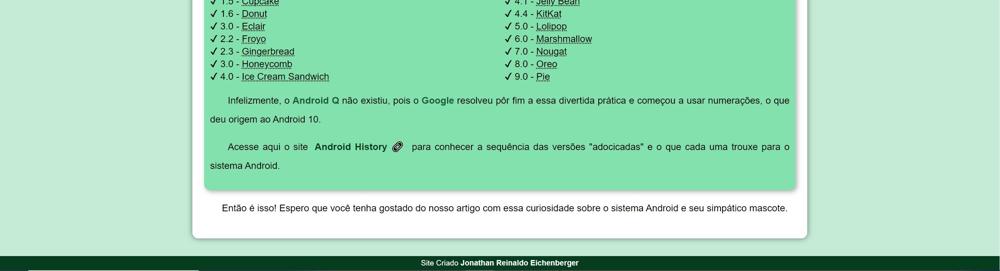

# Projeto: Curiosidades sobre o Android

## Sobre o Projeto
Este projeto tem como objetivo apresentar de forma clara e divertida curiosidades sobre o sistema operacional Android, com foco na história das versões e seus nomes inspirados em doces.

## Conteúdo
* **História das Versões:** Uma tabela detalhada apresenta a evolução das versões do Android, desde a primeira até as mais recentes, com seus respectivos nomes de doces e emojis.
* **Curiosidades:** São explorados fatos interessantes sobre o sistema operacional, como a razão para os nomes de doces e as principais características de cada versão.
* **Layout Visual:** O site é responsivo e possui um design clean e intuitivo, com cores vibrantes e elementos visuais que facilitam a navegação.

## Tecnologias Utilizadas
* **HTML:** Estruturação das páginas.
* **CSS:** Estilização visual.

## Imagens do Projeto

## Créditos
* **Design e projeto** [Curso em Video](https://github.com/cursoemvideo)
* **Desenvolvedor:** [Jonathan Reinaldo Eichenberger](https://www.linkedin.com/in/jonathan-eichenberger/)

